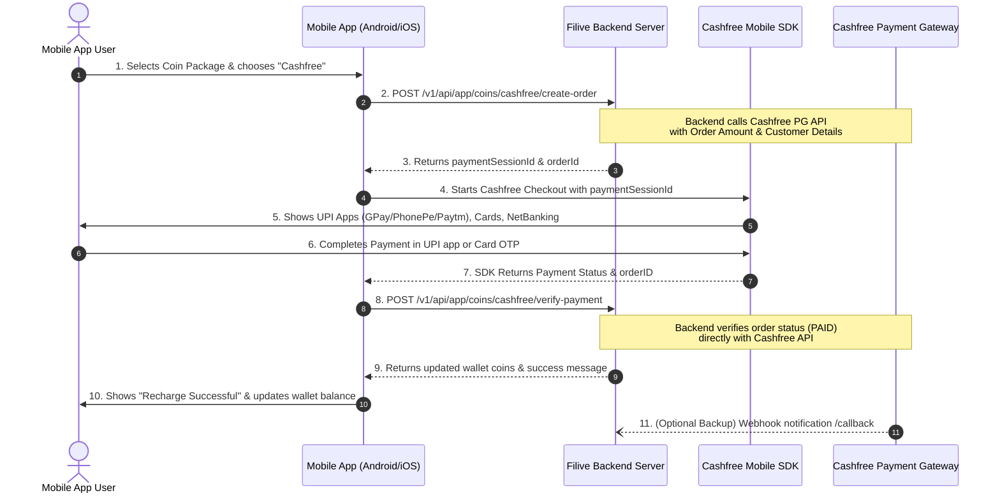

# Cashfree Payment Gateway – Mobile App Integration & API Documentation

This document explains the complete end-to-end integration flow for **Cashfree Payment Gateway** in the Filive Mobile App (Android & iOS).

---

## 1. Complete Payment Flow Overview



---

## 2. API Endpoints for Mobile App

### Base URL:
- Production: `https://filiva-node.creatamax.in/v1/api`
- Local/Staging: `http://<your-server-ip>:5000/v1/api`

All mobile authenticated requests require the standard Bearer Token:
```http
Authorization: Bearer <user_jwt_token>
Content-Type: application/json
```

---

### API 1: Get Available Payment Gateways
Used by the app to fetch active payment gateways allowed for the user's country and audience.

- **Endpoint**: `GET /v1/api/app/payment-methods`
- **Headers**:
  ```http
  Authorization: Bearer <user_token>
  ```
- **Query Parameters**:
  - `countryCode` (optional, string): e.g. `IN` (defaults to user's registered country)
  - `audience` (optional, string): `user` or `seller` (default: `user`)

#### Response Example (200 OK):
```json
{
  "success": true,
  "message": "Payment methods fetched successfully",
  "data": {
    "countryCode": "IN",
    "audience": "user",
    "methods": [
      {
        "gateway": "cashfree",
        "displayName": "Cashfree Payments",
        "targetAudience": "all",
        "countries": ["IN"]
      },
      {
        "gateway": "razorpay",
        "displayName": "Razorpay",
        "targetAudience": "all",
        "countries": ["IN"]
      }
    ]
  }
}
```

---

### API 2: Create Cashfree Order
Creates an order on Cashfree servers and generates a `payment_session_id` required by the Cashfree Android/iOS SDK.

- **Endpoint**: `POST /v1/api/app/coins/cashfree/create-order`
- **Headers**:
  ```http
  Authorization: Bearer <user_token>
  Content-Type: application/json
  ```
- **Request Body**:
```json
{
  "packageId": "65e01234567890abcdef1234",
  "audience": "user"
}
```
> **Notes on Request Parameters**:
> - `packageId` (required, string): MongoDB ID of the selected `CoinPackage`.
> - `audience` (optional, string): `"user"` for normal user recharge, `"seller"` for coin seller stock recharge. Default: `"user"`.

#### Response Example (200 OK):
```json
{
  "success": true,
  "message": "Cashfree order created successfully",
  "data": {
    "success": true,
    "orderId": "CF_U_cdef1234_1726645678123_9876",
    "cfOrderId": "6946567177",
    "paymentSessionId": "session_uSBB2ufZ25yhDcgS9JC-UCLEJekt_4DdBdt85JSwVxTAD4sfhF77_nb1x2kNuLQNlARu_dEKJ35wbRng13pKbqMbl2i6uifQnlPFsKtGoLwbe186w7NVonR4npOM",
    "orderAmount": 100.0,
    "orderCurrency": "INR",
    "environment": "PRODUCTION",
    "audience": "user",
    "package": {
      "id": "65e01234567890abcdef1234",
      "name": "1000 Coins Pack",
      "coins": 1000,
      "price": 100,
      "targetAudience": "all"
    },
    "customerDetails": {
      "customerId": "65d9876543210abcdef1234",
      "customerName": "Rahul Sharma",
      "customerEmail": "user_9876@filive.app",
      "customerPhone": "9876543210"
    }
  }
}
```
> **Key Fields for Cashfree SDK**:
> - `data.orderId`: Unique Order identifier.
> - `data.paymentSessionId`: Mandatory session ID passed into Cashfree SDK `CFPaymentSession`.
> - `data.environment`: `"PRODUCTION"` or `"SANDBOX"`.

---

### API 3: Verify Cashfree Payment
Call this immediately when the Cashfree Mobile SDK finishes and returns a successful response in your app callback.

- **Endpoint**: `POST /v1/api/app/coins/cashfree/verify-payment`
- **Headers**:
  ```http
  Authorization: Bearer <user_token>
  Content-Type: application/json
  ```
- **Request Body**:
```json
{
  "orderId": "CF_U_cdef1234_1726645678123_9876",
  "packageId": "65e01234567890abcdef1234",
  "audience": "user"
}
```

#### Response Example (200 OK):
```json
{
  "success": true,
  "message": "Cashfree payment verified and coins added successfully",
  "data": {
    "success": true,
    "message": "Cashfree payment verified and coins added successfully",
    "transactionId": "CF_U_cdef1234_1726645678123_9876",
    "cfOrderId": "6946567177",
    "orderId": "CF_U_cdef1234_1726645678123_9876",
    "addedCoins": 1000,
    "audience": "user",
    "wallet": "coins",
    "currentCoins": 2500,
    "currentCoinSellerCoins": 0,
    "history": {
      "_id": "65f123456789abcdef012345",
      "userId": "65d9876543210abcdef1234",
      "packageId": "65e01234567890abcdef1234",
      "amount": 1000,
      "type": "recharge",
      "paymentGateway": "Cashfree",
      "description": "Recharged with 1000 Coins Pack via Cashfree (user)",
      "transactionId": "CF_U_cdef1234_1726645678123_9876",
      "createdAt": "2026-09-18T12:08:14.000Z"
    }
  }
}
```

---

### API 4: Webhook Notification (Automatic Server-to-Server)
- **Endpoint**: `POST /v1/api/app/coins/cashfree/callback`
- Configured in the Cashfree Dashboard automatically. If the app closes before calling API 3, the backend webhook will automatically credit the user's coins as soon as Cashfree notifies the server.

---

## 3. Android SDK Integration Guide

Official Cashfree Android Element Documentation:
[https://www.cashfree.com/docs/payments/online/element/mobile/android](https://www.cashfree.com/docs/payments/online/element/mobile/android)

### Step 1: Add Dependency to `build.gradle` (Module: app)
```groovy
dependencies {
    implementation 'com.cashfree.pg:api:2.1.25' // or latest version
}
```

### Step 2: Initialize Callback in your Activity / Fragment (Kotlin)

```kotlin
import com.cashfree.pg.api.CFPaymentGatewayService
import com.cashfree.pg.core.api.CFSession
import com.cashfree.pg.core.api.callback.CFCheckoutResponseCallback
import com.cashfree.pg.core.api.utils.CFErrorResponse
import com.cashfree.pg.ui.api.CFDropCheckoutPayment

class RechargeActivity : AppCompatActivity(), CFCheckoutResponseCallback {

    override fun onCreate(savedInstanceState: Bundle?) {
        super.onCreate(savedInstanceState)
        setContentView(R.layout.activity_recharge)

        // Set Cashfree Callback handler
        try {
            CFPaymentGatewayService.getInstance().setCheckoutCallback(this)
        } catch (e: Exception) {
            e.printStackTrace()
        }
    }

    // Step 3: Trigger Payment when User Clicks "Pay with Cashfree"
    private fun startCashfreePayment(orderId: String, paymentSessionId: String, env: String) {
        try {
            val cfEnvironment = if (env.equals("SANDBOX", ignoreCase = true)) {
                CFSession.Environment.SANDBOX
            } else {
                CFSession.Environment.PRODUCTION
            }

            // Create CFSession using response from /app/coins/cashfree/create-order
            val cfSession = CFSession.CFSessionBuilder()
                .setEnvironment(cfEnvironment)
                .setOrderToken(paymentSessionId) // payment_session_id from API
                .setOrderId(orderId)
                .build()

            // Build Drop Checkout Payment View (Supports UPI, Cards, NetBanking)
            val cfDropCheckoutPayment = CFDropCheckoutPayment.CFDropCheckoutPaymentBuilder()
                .setSession(cfSession)
                .build()

            // Launch Cashfree SDK checkout
            CFPaymentGatewayService.getInstance().doPayment(this, cfDropCheckoutPayment)
        } catch (e: Exception) {
            e.printStackTrace()
            Toast.makeText(this, "Failed to start payment: ${e.message}", Toast.LENGTH_SHORT).show()
        }
    }

    // Step 4: Handle SDK Callbacks
    override fun onPaymentVerify(orderID: String) {
        // Payment success reported by SDK! Now verify on your server to credit coins:
        verifyPaymentOnServer(orderID)
    }

    override fun onPaymentFailure(cfErrorResponse: CFErrorResponse, orderID: String) {
        Toast.makeText(
            this,
            "Payment Failed: ${cfErrorResponse.message ?: "Transaction incomplete"}",
            Toast.LENGTH_LONG
        ).show()
    }

    // Step 5: Call Filive Backend to credit coins
    private fun verifyPaymentOnServer(orderId: String) {
        // Show Loading Dialog
        // Call POST /v1/api/app/coins/cashfree/verify-payment
        // Request Body: { "orderId": orderId, "packageId": selectedPackageId, "audience": "user" }
        // On Success: Show "Recharged Successfully" and update user coins!
    }
}
```

---

## 4. Summary Checklist for App Developer

| Step | Action | API / SDK Method |
|---|---|---|
| 1 | Show package list | `GET /v1/api/app/coin-package` |
| 2 | Check gateway availability | `GET /v1/api/app/payment-methods` |
| 3 | Create Order | `POST /v1/api/app/coins/cashfree/create-order` |
| 4 | Launch SDK | `CFPaymentGatewayService.getInstance().doPayment(activity, cfDropCheckoutPayment)` |
| 5 | Verify & Credit | `POST /v1/api/app/coins/cashfree/verify-payment` |

---

## 5. Testing & Environment

- The backend is pre-configured with **Production (Live)** keys.
- You can test with real micro-transactions (e.g., ₹1 / ₹10) using UPI (PhonePe, GPay, Paytm) or test in Sandbox by switching the toggle in Admin Panel (`Payment Gateways Settings`).
